# Azure Auto-Healing Web Tier

## Overview

This project deploys an auto-healing web tier in Microsoft Azure using Terraform. Internet traffic enters through a Standard Public IP and Azure Standard Load Balancer and is distributed across a Virtual Machine Scale Set (VMSS) running a minimum of two Ubuntu instances. Each instance is provisioned automatically by cloud-init with Docker, which pulls and runs a public ARM64 NGINX container image from GitHub Container Registry (GHCR).

The design demonstrates Infrastructure as Code (IaC), N+1 capacity, health-based instance recovery, automatic capacity restoration, repeatable deployment and Terraform idempotency.

## Platform

Azure was selected as the cloud platform for this implementation. The solution uses Azure-native services including Virtual Machine Scale Sets, Standard Load Balancer, Azure Monitor, and automatic instance repair to implement the required high-availability and self-healing architecture.

Terraform was selected for IaC because it provides a declarative workflow, reusable modules, execution plans and repeatable lifecycle management. The project was developed and validated with Terraform 1.16.4 and AzureRM provider 4.81.0.

## Architecture

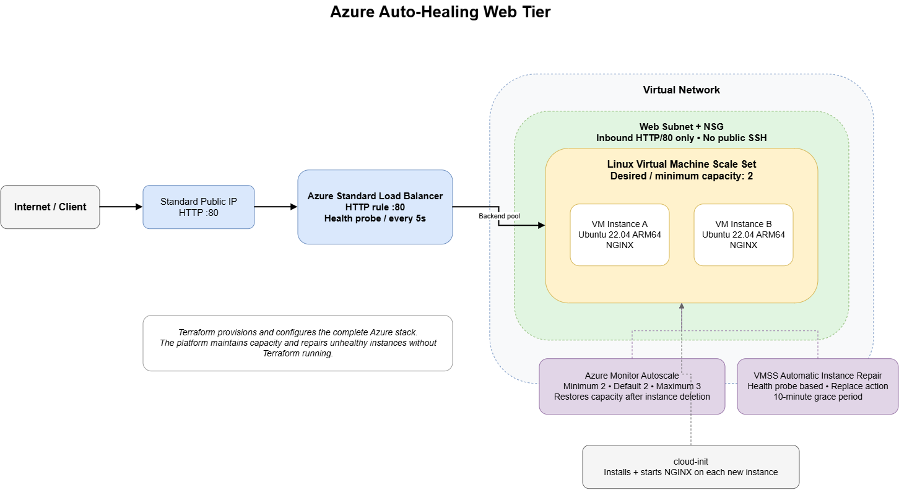

Editable source: [`docs/architecture/azure-auto-healing-web-tier.drawio`](docs/architecture/azure-auto-healing-web-tier.drawio)

The deployed architecture contains:

- Azure Resource Group in Australia East.
- Virtual Network `10.10.0.0/16` with web subnet `10.10.1.0/24`.
- Network Security Group allowing inbound TCP/80 only for the web workload.
- Standard static Public IP.
- Azure Standard Load Balancer with HTTP health probe, inbound HTTP rule and explicit outbound rule.
- Linux Virtual Machine Scale Set with desired/minimum capacity of two instances.
- Ubuntu 22.04 LTS ARM64 instances using `Standard_B2pts_v2`.
- cloud-init bootstrap that installs Docker, pulls the public ARM64 image from GHCR and runs the NGINX container on TCP/80.
- Automatic Instance Repair using the Load Balancer health probe and `Replace` action.
- Azure Monitor Autoscale configured with minimum/default capacity 2 and maximum 3, maintaining the required minimum capacity after an instance is explicitly deleted.

Microsoft documents that VMSS automatic repairs can use Load Balancer health probes and replace unhealthy instances. The configured `PT10M` grace period is the minimum supported value and gives newly created or recently changed instances time to become healthy before a repair action is considered:
https://learn.microsoft.com/en-us/azure/virtual-machine-scale-sets/virtual-machine-scale-sets-automatic-instance-repairs

## Repository Structure

```text
.
├── .github/
│   └── workflows/
│       └── docker-publish.yml
├── docker/
│   ├── Dockerfile
│   └── index.html
├── cloud-init.yaml
├── main.tf
├── moved.tf
├── outputs.tf
├── providers.tf
├── terraform.tfvars.example
├── variables.tf
├── versions.tf
├── modules/
│   └── web-tier/
│       ├── main.tf
│       ├── outputs.tf
│       └── variables.tf
└── docs/
    ├── architecture/
    │   ├── azure-auto-healing-web-tier.drawio
    │   └── azure-auto-healing-web-tier.png
    └── evidence/
        ├── cost/
        ├── deployment/
        ├── docker/
        ├── idempotency/
        └── self-healing/
```

The root module supplies user-facing inputs and calls the reusable `modules/web-tier` child module. `moved.tf` records the refactor from the original root resource addresses into the child module without recreating existing infrastructure.

## Prerequisites

The following are required to reproduce the deployment:

- An Azure subscription with permission to create the resources in this project.
- Terraform 1.16 or later.
- Azure CLI.
- Git.
- An SSH key pair. Only the public key is supplied to Terraform.

Authenticate to Azure:

```powershell
az login
```

Clone the repository and enter the project directory:

```powershell
git clone https://github.com/bishalraktim/azure-auto-healing-web-tier.git
Set-Location .\azure-auto-healing-web-tier
```

If an SSH key is required, create one outside the repository:

```powershell
ssh-keygen -t ed25519 -f "$HOME\.ssh\azure-web-lab" -C "azure-web-lab"
```

Copy the example variable file:

```powershell
Copy-Item .\terraform.tfvars.example .\terraform.tfvars
```

Replace `YOUR_PUBLIC_KEY_HERE` in `terraform.tfvars` with the contents of the `.pub` file. `terraform.tfvars`, Terraform state, plan files and private keys are excluded from Git.

## Deployment

Initialise, format and validate the configuration:

```powershell
terraform init
terraform fmt -recursive
terraform validate
```

Review the execution plan:

```powershell
terraform plan
```

From an empty project environment the validated plan reported:

```text
Plan: 13 to add, 0 to change, 0 to destroy.
```

Provision the complete stack:

```powershell
terraform apply
```

After reviewing the plan, enter `yes` when prompted. A fresh end-to-end rebuild completed with:

```text
Apply complete! Resources: 13 added, 0 changed, 0 destroyed.
```

The command above is the single IaC deployment action after prerequisites and input configuration are complete; no Azure resources need to be created manually.

Retrieve the endpoint and resource names without hard-coding environment-specific values:

```powershell
terraform output
```

The Public IP can change after a full destroy/rebuild, so validation should always use the current Terraform output rather than a previously allocated address.

At the time of the final container validation, the deployed endpoint was:

<http://20.213.52.138/>

The address above represents the current deployment only. `terraform output -raw web_url` remains the authoritative way to retrieve the endpoint after future rebuilds.

### Deployment Evidence

The Terraform-managed Azure resources are shown below.

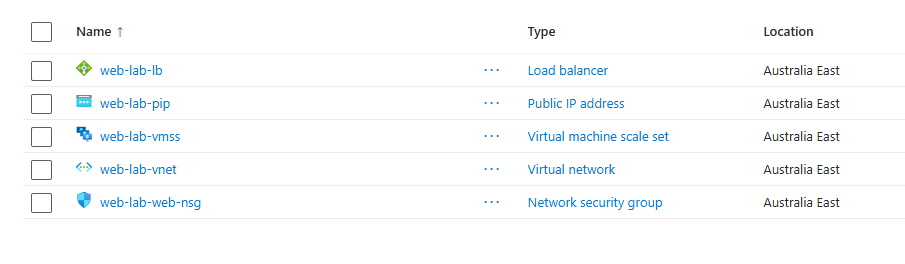

Two healthy VMSS instances were verified before failure testing:

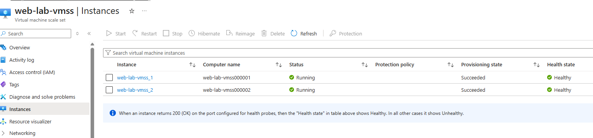

The original load-balanced deployment successfully served the default NGINX page before the container enhancement:

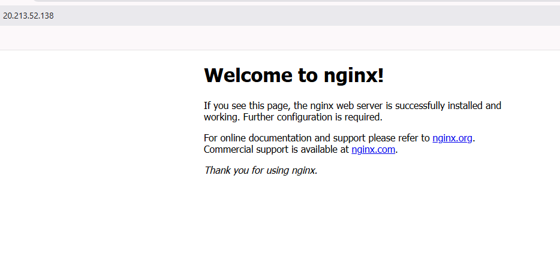

## Validation

### 1. N+1 Capacity

The VM Scale Set was configured with a desired and minimum capacity of two instances. Both instances were verified as successfully provisioned before failure testing:

```powershell
az vmss list-instances `
  --resource-group web-lab-rg `
  --name web-lab-vmss `
  --output table
```

### 2. Load-Balanced Web Endpoint

The endpoint can be validated from PowerShell using the current Terraform output:

```powershell
$webUrl = terraform output -raw web_url
curl.exe $webUrl
```

The current deployment returns the custom static page served by the NGINX container.

### 3. Self-Healing / Capacity Recovery

A VMSS instance was deliberately deleted while the load-balanced HTTP endpoint was continuously monitored:

```powershell
az vmss delete-instances `
  --resource-group web-lab-rg `
  --name web-lab-vmss `
  --instance-ids 2
```

In the selected failure-test capture, one brief failed HTTP request was observed during the transition; subsequent requests returned HTTP 200. Azure then restored the VMSS to two instances by creating a replacement instance. A separate repeat test after the clean rebuild also captured brief HTTP request failures during instance replacement, with successful HTTP responses continuing during the transition. Both observations are retained as measured evidence rather than being described as zero-downtime.

The screenshot below captures the continuous HTTP monitor during deliberate instance deletion.

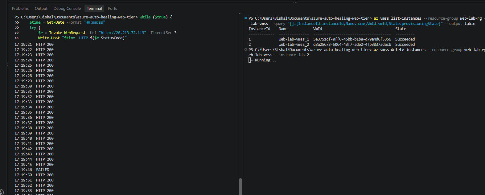

For the original native-NGINX validation, the replacement instance was subsequently verified with NGINX active and returning HTTP 200 locally:

```powershell
az vmss run-command invoke `
  --resource-group web-lab-rg `
  --name web-lab-vmss `
  --instance-id <replacement-instance-id> `
  --command-id RunShellScript `
  --scripts "systemctl is-active nginx && curl -s -o /dev/null -w '%{http_code}' http://localhost"
```

Expected validation output:

```text
active
200
```

The before/after evidence below shows the original instance IDs, the deliberate deletion, the surviving VM retaining its original ID, the new replacement instance receiving a different VM ID, and the replacement NGINX validation (`active` / `200`).

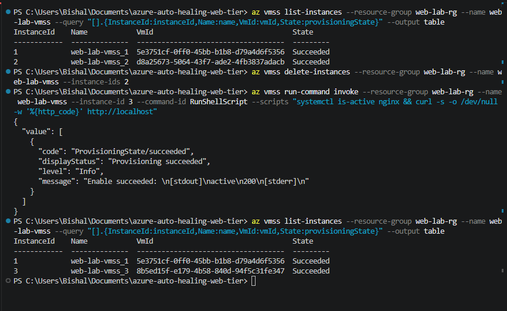

The test demonstrates automatic restoration of the configured VMSS capacity. Brief HTTP request failures observed during instance replacement are retained in the evidence.

A repeat failure test after the clean rebuild is retained below as additional evidence:

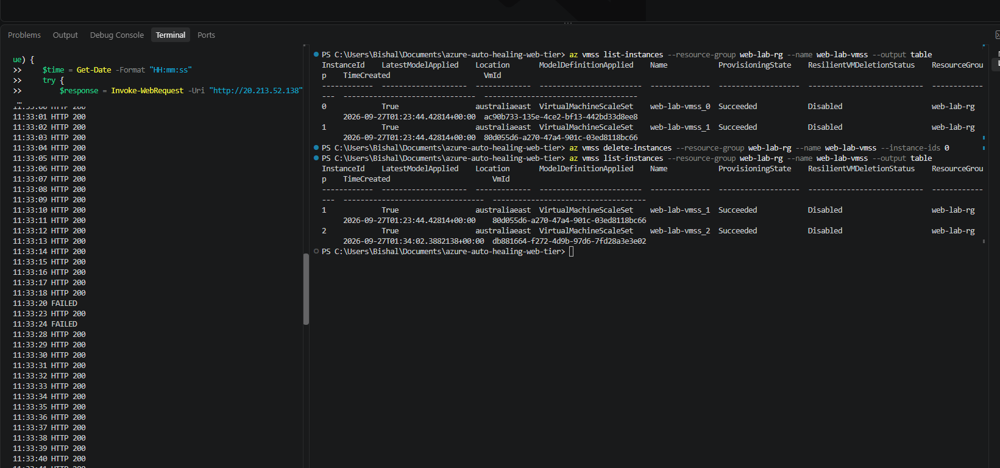

### 4. Full Rebuild

The complete Terraform-managed stack was destroyed and recreated to prove reproducibility rather than relying on previously deployed infrastructure:

```powershell
terraform destroy
terraform plan
terraform apply
```

Observed results:

```text
Destroy complete! Resources: 13 destroyed.
Plan: 13 to add, 0 to change, 0 to destroy.
Apply complete! Resources: 13 added, 0 changed, 0 destroyed.
```

After the rebuild, the VMSS again contained two instances and the web endpoint was reachable through the newly allocated Load Balancer frontend IP.

### 5. Idempotency

After deployment and recovery testing, a subsequent plan was run:

```powershell
terraform plan
```

Terraform reported:

```text
No changes. Your infrastructure matches the configuration.
```

This confirms the committed configuration converges cleanly without unnecessary infrastructure changes.

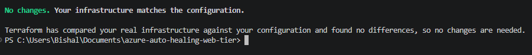

## Container Image and Automated VM Provisioning

The web workload is packaged as an NGINX container image. The repository includes a `Dockerfile` and static `index.html`, while the GitHub Actions workflow builds the image for `linux/arm64` and publishes it to GitHub Container Registry.

Published image:

```text
ghcr.io/bishalraktim/azure-auto-healing-web-tier:latest
```

New VMSS instances bootstrap through `cloud-init.yaml`. The bootstrap installs Docker, enables the Docker service, pulls the public image and starts the container with a restart policy and host TCP/80 mapped to container TCP/80. This means replacement instances created by the scale set can provision the web workload without manual configuration.

The container build and publication completed successfully:

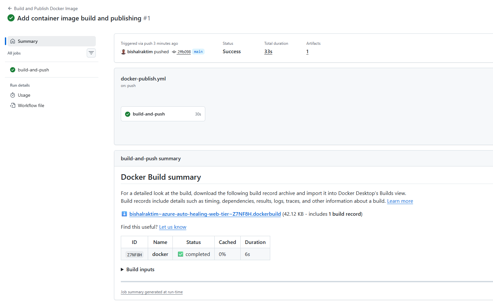

After updating the VMSS model, instances were replaced sequentially so that capacity remained available during the migration. The replacement instances automatically installed Docker and ran the published image:

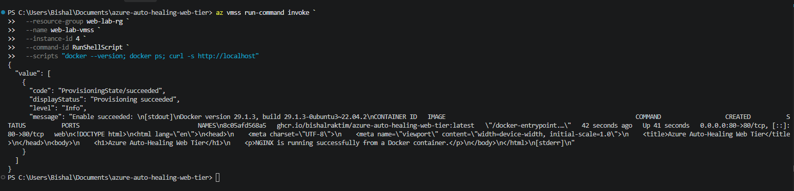

The public Load Balancer endpoint serves the containerised static page:

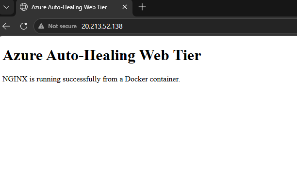

The VMSS was then verified with two healthy replacement instances on the latest model:

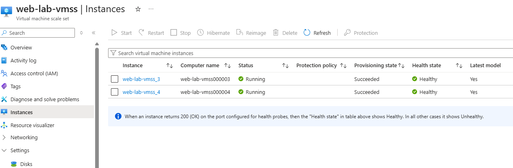

The current container state on a VMSS instance can be checked without exposing SSH publicly:

```powershell
az vmss run-command invoke `
  --resource-group web-lab-rg `
  --name web-lab-vmss `
  --instance-id <instance-id> `
  --command-id RunShellScript `
  --scripts "docker --version; docker ps; curl -s -o /dev/null -w '%{http_code}' http://localhost"
```

A final `terraform plan` after the container rollout reported:

```text
No changes. Your infrastructure matches the configuration.
```

## Security and Network Design

The deployment intentionally keeps the network exposure small:

- Backend VMSS instances have no individual public IP addresses.
- No inbound SSH rule is exposed publicly.
- Linux password authentication is disabled; administration uses an SSH public key.
- The NSG permits only inbound TCP/80 for the demonstrated web workload.
- The subnet has default outbound access disabled.
- VM outbound Internet access required by cloud-init is provided explicitly through the Standard Load Balancer outbound rule.
- Terraform state, `.tfvars`, plan files, private keys, certificates and environment files are excluded from source control.
- Azure authentication is performed outside the Terraform configuration.

HTTP is deliberate for this non-sensitive static availability demonstration. A production deployment would use a DNS name, HTTPS/TLS with trusted certificate management, and normally redirect HTTP to HTTPS. Additional production hardening would also consider zone-spanning VMSS instances, stronger observability and workload-specific access controls.

Azure Standard Load Balancer is used rather than Basic Load Balancer. Microsoft retired Basic Load Balancer on 30 September 2025, and Standard Load Balancer supports explicit outbound rules and a secure-by-default inbound model:
https://learn.microsoft.com/en-us/azure/load-balancer/skus

## Cost Estimate

A 730-hour/month pay-as-you-go estimate was prepared for Australia East using the Azure Pricing Calculator to provide a consistent cost baseline for the deployed architecture.

| Component | Assumption | Estimated monthly cost (AUD) |
| --- | --- | ---: |
| VM compute | 2 × `Standard_B2pts_v2`, Linux, 730 hours | A$21.52 |
| OS disks | 2 × Standard HDD S4 | A$6.90 |
| Standard Load Balancer | 2 rules, 1 GB processed | A$25.38 |
| Standard static Public IPv4 | 1 address, 730 hours | A$5.08 |
| **Total** | | **A$58.88/month** |

The Azure Pricing Calculator estimate used for the cost breakdown is retained below as supporting evidence:

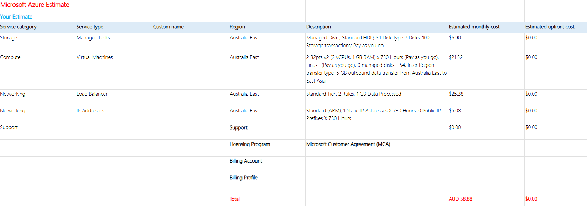

The estimated cost for a continuously running 730-hour deployment is **A$58.88/month**. Standard Load Balancer is retained as the supported load-balancing SKU. For short-lived non-production environments, destroying the infrastructure when it is not required can substantially reduce actual usage costs.

Azure Load Balancer SKU reference:
https://learn.microsoft.com/en-us/azure/load-balancer/skus

## Assumptions and Trade-offs

- This is a non-production reference implementation focused on infrastructure resilience and repeatability.
- A small static NGINX page is sufficient to validate provisioning, load balancing and recovery.
- HTTP is sufficient for this non-sensitive static demonstration; production traffic should use HTTPS/TLS.
- Australia East is used for the deployment.
- Normal desired/minimum VMSS capacity is two; autoscale maximum is three as an upper boundary.
- Low traffic is assumed for the pricing estimate.
- A single-region design was chosen for scope and cost. Production resilience requirements may justify availability zones and/or multi-region architecture.

## Cleanup

When the environment is no longer required, review the destroy plan and remove all Terraform-managed project resources:

```powershell
terraform plan -destroy
terraform destroy
```

The cleanup workflow was tested successfully and removed all 13 Terraform-managed resources. Terraform only removes resources it manages; unrelated Azure resources outside this Terraform state are not part of the cleanup.

## Further Enhancements

The core web tier is complete and validated. Potential enhancements include:

- Adding a Terraform CI workflow for formatting and validation.
- Adding HTTPS/TLS with DNS and trusted certificate management.
- Adding centralised application and infrastructure monitoring.
- Extending the design across availability zones where workload requirements justify it.
